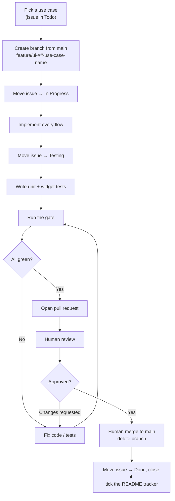

# Development Workflow Document — Heimdall UI

## 1. Purpose

This document defines **how a use case moves from backlog to merged** — the branch, the issue status
transitions, the testing gate, and the pull request. It is the standard every contributor, human or
agent, follows so that each use case (UI-01 … UI-29 in the
[Use Case Specification Document](Use%20Case%20Specification%20Document.md), plus the platform items
P-01 … P-04) is delivered the same way.

It complements the [Testing Specification Document](Testing%20Specification%20Document.md), which
defines *how* the tests are written; this document defines *when* they happen.

> **One use case = one branch = one issue = one pull request.**

## 2. Workflow at a glance



## 3. Issue status lifecycle

| Order | Status | Set when |
| --- | --- | --- |
| 1 | **Todo** | The use case has not been started (default). |
| 2 | **In Progress** | A branch exists and implementation has begun. |
| 3 | **Testing** | Implementation is finished; tests are being written, run, and fixed until green. |
| 4 | **Done** | The pull request has been merged to `main`; the issue is then closed. |

An issue only ever moves forward during normal flow. If review requests changes, work continues on
the same branch, still linked to the same issue.

## 4. Step-by-step

### Step 1 — Branch from `main`

```bash
git switch main
git pull
git switch -c feature/ui-01-login
```

**Branch naming:**

```
feature/ui-##-use-case-name
feature/p-##-item-name
```

- `##` — the zero-padded number (`01`, `02`, … `29`).
- `use-case-name` — the name in lower-case kebab-case.

| Item | Branch |
| --- | --- |
| UI-01: Login | `feature/ui-01-login` |
| UI-14: Manage scope owners | `feature/ui-14-manage-scope-owners` |
| P-04: Health and diagnostics screen | `feature/p-04-health-and-diagnostics-screen` |

### Step 2 — Move the issue to **In Progress**

As soon as the branch exists and work starts.

### Step 3 — Implement every flow

Implement the main flow **and each alternative flow** from the use case specification. An
alternative flow left out is not a smaller delivery; it is an incomplete one, because the alternative
flows are where the interface either handles the API's refusals or does not.

Screens follow the architecture: presentation depends on the domain repository interface, the data
layer wraps the generated client, and nothing in `presentation/` imports
`package:heimdall_api_client`.

### Step 4 — Move the issue to **Testing**

When the implementation is code-complete.

### Step 5 — Test until green

Following the [Testing Specification Document](Testing%20Specification%20Document.md):

1. Write the **unit tests** for the controller and any mapping or guard logic — main flow and each
   applicable alternative flow.
2. Write the **widget tests** for the screen, at every breakpoint whose layout differs, and under
   the dark theme.
3. Run the gate:

```bash
dart format --set-exit-if-changed . && flutter analyze && flutter test
```

4. **Fix** any failure, in the implementation or in the test.
5. **Re-run** until everything passes.

A use case does not leave the Testing stage until the gate is green. Disabling, skipping, or
narrowing a test to reach green is never a fix.

### Step 6 — Open a pull request

Push the branch and open a pull request into `main`, referencing the issue with
`Closes #<issue-number>`. The description states which flows were implemented and how they were
verified.

### Step 7 — Human review and merge

- A **human reviews**. Requested changes are addressed on the same branch, returning to Step 5
  whenever code changes.
- Once approved, a **human merges** into `main`, and the branch is deleted.

> Review and merge are human actions. An agent may prepare and push the pull request, but must not
> self-approve or merge it. The single exception is an authorized batch run — see Step 7.1.

### Step 7.1 — Authorized batch runs

When several use cases are delivered in one unattended run, an agent may merge its own pull
requests, subject to all of the following:

- **The batch was authorized up front.** A human agreed to the specific use cases, in order, and was
  told the agent would merge, close the issues, and delete the branches. A general instruction to
  work autonomously is not this authorization.
- **The invariant holds.** One use case = one branch = one issue = one pull request. Use cases are
  never combined onto a shared branch.
- **The testing gate is unchanged.** The gate is run and read for every use case. A merge on an
  unread or failing gate is never permitted.
- **No protection is bypassed.** No administrative merge, no self-approval to satisfy a required
  review, no force-push, and no disabling of a test to reach green.
- **A failure stops the whole run.** A red gate, a merge conflict, or an ambiguous specification ends
  the batch. Already-merged use cases stay merged; the failing branch and its pull request are left
  in place as evidence.

### Step 8 — Close the issue and tick the tracker

After the merge, set the issue to **Done**, close it, and change the use case's row in the README's
delivery tracker from ⬜ to ✅.

## 5. Definition of Done

A use case is done only when **all** of the following hold:

- [ ] Implemented on a `feature/ui-##-…` or `feature/p-##-…` branch created from `main`.
- [ ] The main flow and **every** alternative flow are implemented.
- [ ] Unit tests cover the controller and any mapping or guard logic.
- [ ] Widget tests cover the screen at every breakpoint whose layout differs.
- [ ] The screen was verified in **both** the light and the dark theme.
- [ ] `dart format --set-exit-if-changed .`, `flutter analyze`, and `flutter test` all pass.
- [ ] No presentation file imports `package:heimdall_api_client`.
- [ ] A pull request was merged to `main` — reviewed by a human, or merged by an agent under an
      authorized batch run.
- [ ] The branch was deleted.
- [ ] The issue is closed and the README tracker is ticked.

## 6. References

- [Use Case Specification Document](Use%20Case%20Specification%20Document.md) — the use cases and their flows.
- [Testing Specification Document](Testing%20Specification%20Document.md) — how the tests are written.
- [System Requirements Document](System%20Requirements%20Document.md) — the requirements being delivered.
- [Technology Stack Document](Technology%20Stack%20Document.md) — the technologies and versions in use.
