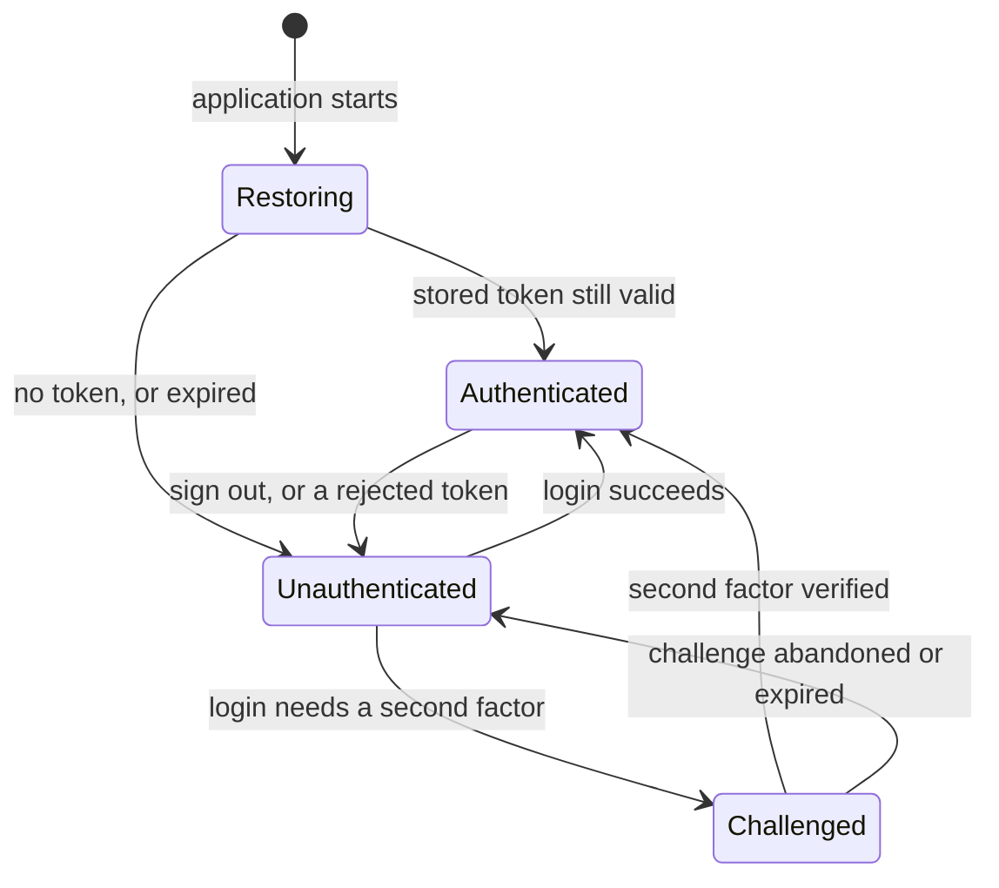
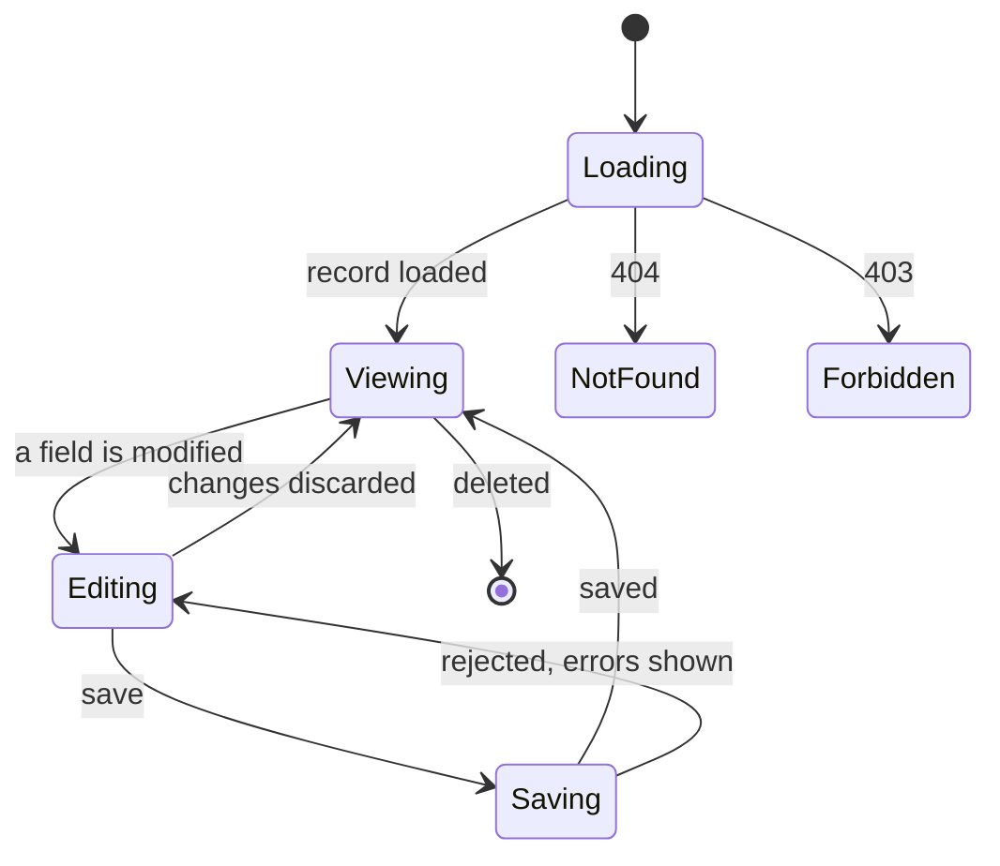

# Use Case Specification Document — Heimdall UI

## 1. Introduction

### 1.1 Purpose

This document specifies **what the Heimdall UI does**, use case by use case. Each use case describes
one coherent piece of work a user performs through the interface, with its main flow and every
alternative flow the implementation must handle.

The UI is a client of the [Heimdall API](https://github.com/artur-rios/heimdall-api). Each use case
carries a **Traces to** line naming the API use cases it consumes, so a change on either side can be
followed to the other. The mapping is deliberately not one-to-one: an API use case that only makes
sense alongside another (viewing and updating a record, for instance) becomes a single screen here,
and one API use case can serve several screens.

### 1.2 Actors

| Actor | Description |
| --- | --- |
| **System Admin** | Belongs to no scope; sees and manages every scope, person, application, permission, and Google user |
| **Scope Admin** | Owns one or more scopes; manages the users, applications, and permissions within them |
| **User** | Belongs to exactly one scope; manages only their own profile and security settings |
| **Anonymous** | An unauthenticated visitor; reaches only the public screens |
| **Heimdall API** | The external system that holds all identity data and enforces all authorization |
| **Google Identity Platform** | External system that authenticates a user and returns a signed ID token |

### 1.3 Use case overview

```mermaid
graph LR
    subgraph Actors
        SA(("System Admin"))
        SCA(("Scope Admin"))
        U(("User"))
        AN(("Anonymous"))
    end

    subgraph "Authentication & Session"
        UI01[UI-01: Login]
        UI02[UI-02: Two-factor challenge]
        UI03[UI-03: Request password recovery]
        UI04[UI-04: Reset password]
        UI05[UI-05: Verify email]
        UI06[UI-06: Google sign-in]
        UI07[UI-07: Route guarding]
    end

    subgraph "Profile & Security"
        UI08[UI-08: Own profile]
        UI09[UI-09: Manage two-factor]
    end

    subgraph "Scope Management"
        UI10[UI-10: Browse scopes]
        UI11[UI-11: Create scope]
        UI12[UI-12: View & update scope]
        UI13[UI-13: Delete scope]
        UI14[UI-14: Manage scope owners]
        UI15[UI-15: Toggle Google Sign-In]
    end

    subgraph "Person Management"
        UI16[UI-16: Browse persons]
        UI17[UI-17: Create person]
        UI18[UI-18: View & update person]
        UI19[UI-19: Delete person]
    end

    subgraph "Application Management"
        UI20[UI-20: Browse applications]
        UI21[UI-21: Create application]
        UI22[UI-22: View & update application]
        UI23[UI-23: Delete application]
    end

    subgraph "Scope Permission Management"
        UI24[UI-24: Browse permissions]
        UI25[UI-25: Create permission]
        UI26[UI-26: View & update permission]
        UI27[UI-27: Delete permission]
    end

    subgraph "Google Users"
        UI28[UI-28: Browse & view Google users]
        UI29[UI-29: Delete Google user]
    end

    AN --> UI01 & UI02 & UI03 & UI04 & UI05 & UI06
    SA & SCA & U --> UI07 & UI08 & UI09
    SA --> UI10 & UI11 & UI12 & UI13 & UI14 & UI15
    SCA --> UI10 & UI12 & UI14 & UI15
    SA & SCA --> UI16 & UI17 & UI18 & UI19
    SA & SCA --> UI20 & UI21 & UI22 & UI23
    SA & SCA --> UI24 & UI25 & UI26 & UI27
    SA & SCA --> UI28 & UI29
```

### 1.4 Inventory and traceability

| ID | Use case | Traces to |
| --- | --- | --- |
| UI-01 | Login | UC-11 |
| UI-02 | Complete two-factor challenge at login | UC-38 |
| UI-03 | Request password recovery | UC-12 |
| UI-04 | Reset password | UC-13 |
| UI-05 | Verify email and resend verification | UC-14, UC-15 |
| UI-06 | Sign in and sign out with Google | UC-25, UC-26 |
| UI-07 | Guard routes by session and role | — |
| UI-08 | View and edit own profile | UC-07, UC-08 |
| UI-09 | Manage two-factor authentication | UC-36, UC-37, UC-39, UC-40 |
| UI-10 | Browse and search scopes | UC-02 |
| UI-11 | Create a scope | UC-01 |
| UI-12 | View and update a scope | UC-02, UC-03 |
| UI-13 | Delete a scope, logically and permanently | UC-04, UC-05 |
| UI-14 | Manage scope owners | UC-21, UC-22, UC-23 |
| UI-15 | Toggle Google Sign-In for a scope | UC-24 |
| UI-16 | Browse and search persons in a scope | UC-07 |
| UI-17 | Create a person | UC-06 |
| UI-18 | View and update a person | UC-07, UC-08 |
| UI-19 | Delete a person, logically and permanently | UC-09, UC-10 |
| UI-20 | Browse applications in a scope | UC-17 |
| UI-21 | Create an application | UC-16 |
| UI-22 | View and update an application | UC-17, UC-18 |
| UI-23 | Delete an application, logically and permanently | UC-19, UC-20 |
| UI-24 | Browse scope permissions | UC-32 |
| UI-25 | Create a scope permission | UC-31 |
| UI-26 | View and update a scope permission | UC-32, UC-33 |
| UI-27 | Delete a scope permission, logically and permanently | UC-34, UC-35 |
| UI-28 | Browse and view Google users | UC-27 |
| UI-29 | Delete a Google user, logically and permanently | UC-28, UC-29 |

### 1.5 Platform items

These are not use cases. They carry no user-facing flow of their own, but they are tracked and
delivered the same way.

| ID | Item |
| --- | --- |
| P-01 | Project scaffolding and initial infrastructure |
| P-02 | Generated API client and specification drift check |
| P-03 | Multi-platform build and release pipelines |
| P-04 | API health and diagnostics screen (consumes UC-30) |

### 1.6 Conventions used below

- **Errors from the API** are the `errors` array of its response envelope. Wherever a flow says the
  client "shows the returned errors", it means those strings, attached to the offending field when
  the error names one and shown in a banner otherwise.
- **Client-side validation** never replaces the API's. It exists to avoid a pointless round trip, and
  the API remains the authority.
- **Every identifier** in a route or a request is a `PublicId` GUID.
- **A destructive action** is one that deletes. Every destructive action requires a confirmation
  dialog naming the record, and a permanent deletion additionally requires the user to type the
  record's name to enable the confirm button.

---

## 2. Use case specifications

---

### UI-01: Login

**Actor:** Anonymous
**Traces to:** UC-11 (Login)
**Precondition:** The application is configured with a reachable API base URL and no valid session exists.

**Main flow**

1. The user opens the application and is redirected to the login screen.
2. The user enters an email address and a password.
3. The user submits the form.
4. The client calls `POST /api/auth/login`.
5. The API answers with a token and its expiry.
6. The client stores the token, establishes the session, and redirects to the screen the user
   originally requested, or to the home screen.

**Alternative flows**

- **AF-01a — Invalid credentials.** The API answers unsuccessfully. The client shows the returned
  errors above the form, keeps the email, and clears the password.
- **AF-01b — Client-side validation fails.** An empty or malformed email, or an empty password,
  blocks submission and marks the offending field. No request is made.
- **AF-01c — Two-factor required.** The response carries `requiresTwoFactor`, a `challengeToken`,
  and `availableMethods`. The client moves the session to `challenged` and routes to UI-02 instead
  of establishing a session.
- **AF-01d — API unreachable.** A transport failure or timeout shows a retryable banner; no session
  state changes.
- **AF-01e — Google Sign-In offered.** The login screen also presents the Google sign-in control
  described in UI-06.

---

### UI-02: Complete two-factor challenge at login

**Actor:** Anonymous (holding a challenge)
**Traces to:** UC-38 (Verify Second Factor)
**Precondition:** The session is in the `challenged` state with a challenge token and a list of available methods.

**Main flow**

1. The client shows the challenge screen, naming the method in use.
2. The user enters the code from their authenticator application, from the email the API sent, or a
   recovery code.
3. The client calls `POST /api/auth/2fa/verify` with the challenge token and the code.
4. The API answers with a token and its expiry.
5. The client stores the token, establishes the session, and redirects onward.

**Alternative flows**

- **AF-02a — Wrong code.** The API answers unsuccessfully. The client shows the returned errors,
  clears the code field, and keeps the challenge alive.
- **AF-02b — Challenge expired or rejected.** The API answers with an expired or invalid challenge.
  The client discards the challenge, returns to UI-01, and explains that the sign-in must restart.
- **AF-02c — More than one method available.** When `availableMethods` holds more than one entry the
  user may switch between them; the chosen method is remembered for the duration of the challenge.
- **AF-02d — Recovery code used.** The user enters a recovery code instead of a generated one. On
  success the client reminds them that the code is now spent, and points at UI-09.
- **AF-02e — Abandoned challenge.** The user leaves the screen. The challenge token is discarded and
  the session returns to unauthenticated; it is never persisted.

---

### UI-03: Request password recovery

**Actor:** Anonymous
**Traces to:** UC-12 (Password Recovery)
**Precondition:** None.

**Main flow**

1. The user opens the password recovery screen from the login screen.
2. The user enters their email address.
3. The client calls `POST /api/auth/password-recovery`.
4. The client shows the same neutral confirmation regardless of whether the address exists, telling
   the user to check their inbox.

**Alternative flows**

- **AF-03a — Client-side validation fails.** An empty or malformed address blocks submission.
- **AF-03b — API unreachable.** A transport failure shows a retryable banner. The confirmation is
  not shown, since nothing was sent.
- **AF-03c — Repeated submission.** The submit control is disabled while a request is in flight, so
  a double tap cannot send twice.

> The neutral confirmation is deliberate: the interface must not reveal whether an address is
> registered.

---

### UI-04: Reset password

**Actor:** Anonymous
**Traces to:** UC-13 (Reset Password)
**Precondition:** The user holds a reset token, normally arriving as a link that opens the application at `/password-reset?token=…`.

**Main flow**

1. The client opens the reset screen with the token from the link.
2. The user enters a new password and confirms it.
3. The client calls `POST /api/auth/password-reset` with the token and the new password.
4. The API confirms. The client shows a success message and offers to sign in.

**Alternative flows**

- **AF-04a — Missing token.** The screen opens without a token. The client explains that the link is
  incomplete and offers UI-03.
- **AF-04b — Invalid or expired token.** The API rejects it. The client shows the returned errors
  and offers UI-03.
- **AF-04c — Passwords do not match.** Client-side validation blocks submission and marks the
  confirmation field.
- **AF-04d — Password rejected by policy.** The API answers unsuccessfully. The client shows the
  returned errors against the password field.

---

### UI-05: Verify email and resend verification

**Actor:** Anonymous, or any authenticated actor
**Traces to:** UC-14 (Email Verification), UC-15 (Resend Verification Email)
**Precondition:** For verification, the user holds a verification token, normally arriving as a link that opens the application at `/verify-email?token=…`.

**Main flow**

1. The client opens the verification screen with the token from the link.
2. The client calls `POST /api/auth/verify-email` immediately, showing progress.
3. The API confirms. The client shows a success message and routes onward — to the home screen when
   a session exists, and to login otherwise.

**Alternative flows**

- **AF-05a — Missing token.** The screen opens without a token and offers the resend action instead.
- **AF-05b — Invalid or expired token.** The API rejects it. The client shows the returned errors
  and offers the resend action.
- **AF-05c — Resend requested.** The user asks for a new email. The client calls
  `POST /api/auth/resend-verification` and shows a neutral confirmation.
- **AF-05d — Already verified.** The API reports the address as already verified. The client treats
  this as success and says so plainly.
- **AF-05e — Unverified session banner.** An authenticated user whose address is unverified sees a
  dismissible banner on the home screen offering the resend action.

---

### UI-06: Sign in and sign out with Google

**Actor:** Anonymous, Google User
**Traces to:** UC-25 (Sign Up / Sign In via Google), UC-26 (Sign Out via Google)
**Precondition:** The build is configured with a Google client id, and the target scope has Google Sign-In enabled.

**Main flow**

1. The login screen shows a Google sign-in control alongside the credentials form.
2. The user activates it and completes Google's own flow.
3. Google returns a signed ID token to the client.
4. The client calls `POST /api/auth/google` with the ID token and the target scope.
5. The API answers with a Heimdall token and its expiry.
6. The client stores the token, establishes the session, and redirects onward.

**Sign out**

1. A Google-authenticated user signs out.
2. The client calls `POST /api/auth/google/sign-out`, clears the local Google session, discards the
   token, and returns to the login screen.

**Alternative flows**

- **AF-06a — Not configured.** No Google client id is present in the build. The control is hidden
  entirely rather than shown as broken.
- **AF-06b — Google Sign-In disabled for the scope.** The API rejects the exchange. The client shows
  the returned errors and leaves the credentials form available.
- **AF-06c — User cancels Google's flow.** No request is made and the login screen is unchanged.
- **AF-06d — Exchange rejected.** The API rejects the ID token. The client shows the returned errors
  and clears the pending Google session.
- **AF-06e — Platform without support.** On a target where the Google flow is unavailable the
  control is hidden, and the credentials form remains the only route in.

---

### UI-07: Guard routes by session and role

**Actor:** All
**Traces to:** — (cross-cutting; enforces the API's authorization matrix in the interface)
**Precondition:** None.

**Main flow**

1. A caller requests a route, by navigation or by opening a URL directly.
2. The client classifies the route as public or private, and reads the session state.
3. An authenticated caller with a permitted role reaches the route.

**Alternative flows**

- **AF-07a — No session.** A private route redirects to login, carrying the requested location so
  the user lands there after signing in.
- **AF-07b — Challenge in progress.** Every route except the challenge screen redirects to it.
- **AF-07c — Session being restored.** While the stored token is read at start-up, no redirect is
  decided and a loading state is shown; a slow read must not bounce the user to login.
- **AF-07d — Role not permitted.** An authenticated caller requesting a route their role cannot use
  is shown a "not available for your role" screen, not a redirect loop.
- **AF-07e — Token rejected mid-session.** Any `401` clears the session and redirects to login,
  explaining that the session ended.
- **AF-07f — Already signed in.** An authenticated caller requesting login or the challenge screen
  is redirected to the home screen.
- **AF-07g — Expired stored token.** A token whose expiry has passed is discarded at start-up
  without contacting the API.

---

### UI-08: View and edit own profile

**Actor:** System Admin, Scope Admin, User
**Traces to:** UC-07 (View Person), UC-08 (Update Person)
**Precondition:** A session exists.

**Main flow**

1. The user opens their profile.
2. The client calls `GET /api/persons/{id}` for the signed-in person and shows name, email, role,
   verification status, and scope membership.
3. The user edits their name or email and saves.
4. The client calls `PUT /api/persons/{id}` and shows the updated record.

**Alternative flows**

- **AF-08a — Client-side validation fails.** An empty name or a malformed email blocks submission.
- **AF-08b — Update rejected.** The API answers unsuccessfully, for instance because the email is
  already taken. The client shows the returned errors against the offending field and keeps the
  user's input.
- **AF-08c — Email changed.** The API marks the address unverified again. The client says so and
  offers the resend action from UI-05.
- **AF-08d — Nothing changed.** Saving with no modification is a no-op; the save control stays
  disabled until a field actually differs.
- **AF-08e — Record unavailable.** The API answers `404`, meaning the person was deleted from under
  the session. The client signs the user out and explains why.

---

### UI-09: Manage two-factor authentication

**Actor:** System Admin, Scope Admin, User
**Traces to:** UC-36 (Enable), UC-37 (Confirm Setup), UC-39 (Disable), UC-40 (Regenerate Recovery Codes)
**Precondition:** A session exists.

**Main flow — enabling**

1. The user opens the security section of their profile, which states whether two-factor
   authentication is on.
2. The user chooses a method and starts enabling it.
3. The client calls `POST /api/auth/2fa/enable`.
4. For an authenticator method the API returns an `otpAuthUri`; the client renders it as a QR code
   and also shows the secret as text for manual entry. For the email method the API reports that a
   code was sent.
5. The user enters the code from their authenticator or their inbox.
6. The client calls `POST /api/auth/2fa/confirm`.
7. The API confirms and returns the recovery codes. The client shows them once, offers to copy or
   download them, and requires the user to acknowledge before leaving.

**Main flow — disabling**

1. The user chooses to turn two-factor authentication off and confirms.
2. The client calls `POST /api/auth/2fa/disable` with the credential the API requires.
3. The section returns to the disabled state.

**Main flow — regenerating recovery codes**

1. The user asks for new recovery codes and confirms that the current ones stop working.
2. The client calls `POST /api/auth/2fa/recovery-codes/regenerate` and shows the new codes once,
   under the same acknowledgement rule.

**Alternative flows**

- **AF-09a — Wrong confirmation code.** The API rejects it. The client shows the returned errors and
  keeps the setup alive so the user can try again without restarting.
- **AF-09b — Setup abandoned.** The user leaves before confirming. Two-factor authentication stays
  off, and the pending secret is discarded from client memory.
- **AF-09c — Recovery codes not acknowledged.** Navigation away is blocked by a confirmation, since
  the codes are shown exactly once.
- **AF-09d — Disable rejected.** The API rejects the credential. The client shows the returned
  errors and leaves the feature on.
- **AF-09e — QR code cannot be rendered.** The client always shows the secret as selectable text
  next to the QR code, so a rendering failure never blocks setup.

---

### UI-10: Browse and search scopes

**Actor:** System Admin, Scope Admin
**Traces to:** UC-02 (View Scope)
**Precondition:** A session exists.

**Main flow**

1. The user opens the scopes screen.
2. The client calls `GET /api/scopes` with the current page, page size, name filter, and the
   include-deleted flag.
3. The client shows the page — cards on a compact window, a table on an expanded one — with the
   name, description, Google Sign-In state, owner count, and deletion state of each scope.
4. The user pages, searches by name, or toggles whether deleted scopes are included.

**Alternative flows**

- **AF-10a — Empty result.** An empty-state panel distinguishes "no scopes yet", which offers
  UI-11, from "no matches", which offers to clear the filter.
- **AF-10b — Request fails.** An error panel shows the returned errors and offers a retry, keeping
  the current filters.
- **AF-10c — Scope Admin.** The listing returns only the scopes the signed-in admin owns; the
  create control is hidden, since only a System Admin may create a scope.
- **AF-10d — Filter changes reset paging.** Editing the search or the include-deleted flag returns
  to the first page.
- **AF-10e — Loading.** A placeholder occupies the list while the first page loads, so the layout
  does not jump.

---

### UI-11: Create a scope

**Actor:** System Admin
**Traces to:** UC-01 (Create Scope)
**Precondition:** A session exists whose role is System Admin.

**Main flow**

1. The user opens the create-scope form from the scopes screen.
2. The user enters a name and a description, and selects at least one owner.
3. The client calls `POST /api/scopes`.
4. The API creates the scope. The client shows a confirmation and opens the new scope's detail.

**Alternative flows**

- **AF-11a — Client-side validation fails.** An empty name, or no owner selected, blocks submission.
- **AF-11b — Name already exists.** The API answers unsuccessfully. The client shows the returned
  errors against the name field and keeps the rest of the form.
- **AF-11c — Owner rejected.** The API rejects an owner that is not a Scope Admin. The client shows
  the returned errors against the owner selector.
- **AF-11d — Cancelled with changes.** Leaving a modified form asks for confirmation first.
- **AF-11e — Request fails.** A transport failure leaves the form filled in and offers a retry.

---

### UI-12: View and update a scope

**Actor:** System Admin, Scope Admin
**Traces to:** UC-02 (View Scope), UC-03 (Update Scope)
**Precondition:** A session exists, and a Scope Admin may only open a scope they own.

**Main flow**

1. The user opens a scope from the listing, or by URL.
2. The client calls `GET /api/scopes/{id}` and shows the scope with its owners, its Google Sign-In
   state, and links to its persons, applications, permissions, and Google users.
3. The user edits the name or description and saves.
4. The client calls `PUT /api/scopes/{id}` and shows the updated record.

**Alternative flows**

- **AF-12a — Not found.** The API answers `404`. The client shows a not-found panel with a way back
  to the listing.
- **AF-12b — Forbidden.** The API answers `403`. The client shows the not-available-for-your-role
  panel described in UI-07.
- **AF-12c — Update rejected.** The API answers unsuccessfully, for instance on a duplicate name.
  The client shows the returned errors against the offending field.
- **AF-12d — Deleted scope.** A logically deleted scope is shown read-only, marked as deleted.
- **AF-12e — Nothing changed.** The save control stays disabled until a field actually differs.

---

### UI-13: Delete a scope, logically and permanently

**Actor:** System Admin
**Traces to:** UC-04 (Logical Delete Scope), UC-05 (Hard Delete Scope)
**Precondition:** A session exists whose role is System Admin, and the scope is open.

**Main flow — logical deletion**

1. The user chooses to delete the scope.
2. A confirmation dialog names the scope and explains that the record is kept and can be restored by
   the API.
3. The client calls `DELETE /api/scopes/{id}` and returns to the listing with a confirmation.

**Main flow — permanent deletion**

1. The user chooses to delete the scope permanently.
2. A confirmation dialog names the scope, states that the record and its contents are erased, and
   requires the scope's name to be typed before the confirm control is enabled.
3. The client calls `DELETE /api/scopes/{id}/hard` and returns to the listing with a confirmation.

**Alternative flows**

- **AF-13a — Cancelled.** The dialog closes and nothing is sent.
- **AF-13b — Rejected.** The API refuses, for instance because the scope still holds users. The
  client shows the returned errors and leaves the scope open.
- **AF-13c — Typed name does not match.** The confirm control stays disabled.
- **AF-13d — Already deleted.** The API answers `404`. The client treats it as done and returns to
  a refreshed listing.
- **AF-13e — Not permitted.** A Scope Admin never sees either control.

---

### UI-14: Manage scope owners

**Actor:** System Admin, Scope Admin
**Traces to:** UC-21 (Add Scope Owner), UC-22 (Remove Scope Owner), UC-23 (Promote User to Scope Owner)
**Precondition:** A session exists, and a Scope Admin may only manage the scopes they own.

**Main flow**

1. The user opens the owners section of a scope, which lists the current owners.
2. The client calls `GET /api/scopes/{scopeId}/owners`.
3. The user adds an existing Scope Admin as a co-owner, and the client calls
   `POST /api/scopes/{scopeId}/owners/{personId}`.
4. The user creates a brand-new Scope Admin as a co-owner, and the client calls
   `POST /api/scopes/{scopeId}/owners`.
5. The user promotes an existing user of the scope, and the client calls
   `POST /api/scopes/{scopeId}/users/{personId}/promote` after a confirmation explaining that the
   person stops being a user of the scope.
6. The user removes an owner, and the client calls
   `DELETE /api/scopes/{scopeId}/owners/{personId}` after a confirmation.

**Alternative flows**

- **AF-14a — Last owner.** The API refuses to remove the only owner. The client shows the returned
  errors; the remove control is disabled when the list holds a single owner.
- **AF-14b — Person is not a Scope Admin.** The API refuses. The client shows the returned errors
  against the selector.
- **AF-14c — Already an owner.** The API refuses a duplicate. The client shows the returned errors,
  and already-listed owners are excluded from the selector.
- **AF-14d — Creating a co-owner fails validation.** An empty name, a malformed email, or a rejected
  password shows the returned errors against the offending field.
- **AF-14e — Promotion cancelled.** The dialog closes and nothing is sent.
- **AF-14f — Removing yourself.** A Scope Admin removing their own ownership is warned that they
  lose access to the scope, and the listing refreshes accordingly afterwards.

---

### UI-15: Toggle Google Sign-In for a scope

**Actor:** System Admin, Scope Admin
**Traces to:** UC-24 (Enable/Disable Google Sign-In)
**Precondition:** A session exists, and a Scope Admin may only change a scope they own.

**Main flow**

1. The scope detail shows a control reflecting the current `googleSignInEnabled` state.
2. The user toggles it.
3. The client calls `PUT /api/scopes/{id}/google-signin` with the new value.
4. The control settles on the confirmed state.

**Alternative flows**

- **AF-15a — Rejected.** The API refuses. The control returns to its previous state and the returned
  errors are shown.
- **AF-15b — Disabling with Google users present.** The confirmation explains that existing Google
  users can no longer sign in, before anything is sent.
- **AF-15c — In flight.** The control is disabled while the request is outstanding, so it cannot be
  toggled twice.

---

### UI-16: Browse and search persons in a scope

**Actor:** System Admin, Scope Admin
**Traces to:** UC-07 (View Person)
**Precondition:** A session exists, and a scope is selected.

**Main flow**

1. The user opens the persons screen of a scope.
2. The client calls `GET /api/scopes/{scopeId}/persons` with the page, page size, filters, and the
   include-deleted flag.
3. The client shows the page with each person's name, email, role, verification state, and deletion
   state.
4. The user pages, searches, or toggles whether deleted persons are included.

**Alternative flows**

- **AF-16a — Empty result.** The empty state distinguishes "no persons yet", offering UI-17, from
  "no matches", offering to clear the filter.
- **AF-16b — Request fails.** An error panel shows the returned errors and offers a retry.
- **AF-16c — Forbidden.** A Scope Admin opening a scope they do not own gets the
  not-available-for-your-role panel.
- **AF-16d — Filter changes reset paging.**

---

### UI-17: Create a person

**Actor:** System Admin, Scope Admin
**Traces to:** UC-06 (Create Person)
**Precondition:** A session exists, and a Scope Admin may only create within a scope they own.

**Main flow**

1. The user opens the create-person form.
2. The user enters a name, an email, a password, and a role.
3. The client calls `POST /api/scopes/{scopeId}/persons`, or `POST /api/persons` when a System Admin
   creates a person that belongs to no scope.
4. The API creates the person and sends the verification email. The client confirms and opens the
   new person's detail.

**Alternative flows**

- **AF-17a — Client-side validation fails.** An empty name, a malformed email, or an empty password
  blocks submission.
- **AF-17b — Email already registered.** The API answers unsuccessfully. The client shows the
  returned errors against the email field.
- **AF-17c — Password rejected by policy.** The client shows the returned errors against the
  password field.
- **AF-17d — Role not permitted.** A Scope Admin may not create a System Admin; that option is not
  offered, and a rejection from the API is shown as returned.
- **AF-17e — Cancelled with changes.** Leaving a modified form asks for confirmation first.

---

### UI-18: View and update a person

**Actor:** System Admin, Scope Admin
**Traces to:** UC-07 (View Person), UC-08 (Update Person)
**Precondition:** A session exists, and the person is within reach of the signed-in role.

**Main flow**

1. The user opens a person from the listing, or by URL.
2. The client calls `GET /api/persons/{id}` and shows the record with its role, scope membership,
   owned scopes, and verification state.
3. The user edits the name or email and saves.
4. The client calls `PUT /api/persons/{id}` and shows the updated record.

**Alternative flows**

- **AF-18a — Not found.** The API answers `404`; a not-found panel offers a way back.
- **AF-18b — Forbidden.** The API answers `403`; the not-available-for-your-role panel is shown.
- **AF-18c — Update rejected.** The returned errors are shown against the offending field.
- **AF-18d — Deleted person.** A logically deleted person is shown read-only, marked as deleted.
- **AF-18e — Editing yourself.** Opening your own record from the administrative listing offers the
  same editing as UI-08, and never lets you change your own role.

---

### UI-19: Delete a person, logically and permanently

**Actor:** System Admin, Scope Admin (logical only)
**Traces to:** UC-09 (Logical Delete Person), UC-10 (Hard Delete Person)
**Precondition:** A session exists and the person is open.

**Main flow — logical deletion**

1. The user chooses to delete the person and confirms in a dialog naming them.
2. The client calls `DELETE /api/persons/{id}` and returns to the listing with a confirmation.

**Main flow — permanent deletion**

1. A System Admin chooses to delete the person permanently.
2. The dialog names the person, states that the record is erased, and requires their email to be
   typed before the confirm control is enabled.
3. The client calls `DELETE /api/persons/{id}/hard` and returns to the listing.

**Alternative flows**

- **AF-19a — Cancelled.** Nothing is sent.
- **AF-19b — Rejected.** The API refuses, for instance for the last owner of a scope. The returned
  errors are shown and the person stays open.
- **AF-19c — Typed email does not match.** The confirm control stays disabled.
- **AF-19d — Deleting yourself.** The controls are disabled on your own record.
- **AF-19e — Not permitted.** A Scope Admin never sees the permanent deletion control.

---

### UI-20: Browse applications in a scope

**Actor:** System Admin, Scope Admin
**Traces to:** UC-17 (View Application)
**Precondition:** A session exists and a scope is selected.

**Main flow**

1. The user opens the applications screen of a scope.
2. The client calls `GET /api/scopes/{scopeId}/applications` with the page, page size, filters, and
   the include-deleted flag.
3. The client shows the page with each application's name, owner, and deletion state.
4. The user pages, searches, or toggles whether deleted applications are included.

**Alternative flows**

- **AF-20a — Empty result.** The empty state distinguishes "none yet", offering UI-21, from "no
  matches".
- **AF-20b — Request fails.** An error panel shows the returned errors and offers a retry.
- **AF-20c — Forbidden.** The not-available-for-your-role panel is shown.
- **AF-20d — Owner no longer resolvable.** An owner that cannot be resolved to a person is shown by
  its identifier rather than blanking the row.

---

### UI-21: Create an application

**Actor:** System Admin, Scope Admin
**Traces to:** UC-16 (Create Application)
**Precondition:** A session exists, and a Scope Admin may only create within a scope they own.

**Main flow**

1. The user opens the create-application form.
2. The user enters a name and selects an owner from the persons associated with the scope.
3. The client calls `POST /api/scopes/{scopeId}/applications`.
4. The API creates the application. The client confirms and opens its detail.

**Alternative flows**

- **AF-21a — Client-side validation fails.** An empty name, or no owner selected, blocks submission.
- **AF-21b — Name already exists in the scope.** The returned errors are shown against the name.
- **AF-21c — Owner not associated with the scope.** The API refuses; the returned errors are shown
  against the owner selector, which lists only persons of that scope.
- **AF-21d — Cancelled with changes.** Leaving a modified form asks for confirmation first.

---

### UI-22: View and update an application

**Actor:** System Admin, Scope Admin
**Traces to:** UC-17 (View Application), UC-18 (Update Application)
**Precondition:** A session exists and the application is within reach of the signed-in role.

**Main flow**

1. The user opens an application from the listing, or by URL.
2. The client calls `GET /api/scopes/{scopeId}/applications/{id}` and shows it with its owner.
3. The user edits the name or the owner and saves.
4. The client calls `PUT /api/scopes/{scopeId}/applications/{id}` and shows the updated record.

**Alternative flows**

- **AF-22a — Not found.** A not-found panel offers a way back.
- **AF-22b — Forbidden.** The not-available-for-your-role panel is shown.
- **AF-22c — Update rejected.** The returned errors are shown against the offending field.
- **AF-22d — Deleted application.** Shown read-only, marked as deleted.
- **AF-22e — Nothing changed.** The save control stays disabled until a field differs.

---

### UI-23: Delete an application, logically and permanently

**Actor:** System Admin, Scope Admin (logical only)
**Traces to:** UC-19 (Logical Delete Application), UC-20 (Hard Delete Application)
**Precondition:** A session exists and the application is open.

**Main flow — logical deletion**

1. The user chooses to delete the application and confirms in a dialog naming it.
2. The client calls `DELETE /api/scopes/{scopeId}/applications/{id}` and returns to the listing.

**Main flow — permanent deletion**

1. A System Admin chooses permanent deletion, and the dialog requires the application's name to be
   typed.
2. The client calls `DELETE /api/scopes/{scopeId}/applications/{id}/hard` and returns to the
   listing.

**Alternative flows**

- **AF-23a — Cancelled.** Nothing is sent.
- **AF-23b — Rejected.** The returned errors are shown and the application stays open.
- **AF-23c — Typed name does not match.** The confirm control stays disabled.
- **AF-23d — Not permitted.** A Scope Admin never sees the permanent deletion control.

---

### UI-24: Browse scope permissions

**Actor:** System Admin, Scope Admin
**Traces to:** UC-32 (View Scope Permission)
**Precondition:** A session exists and a scope is selected.

**Main flow**

1. The user opens the permissions screen of a scope.
2. The client calls `GET /api/scopes/{scopeId}/permissions` with the page, page size, filters, and
   the include-deleted flag.
3. The client shows each permission's name, description, whether it is included as a JWT claim, and
   its deletion state.

**Alternative flows**

- **AF-24a — Empty result.** The empty state distinguishes "none yet", offering UI-25, from "no
  matches".
- **AF-24b — Request fails.** An error panel shows the returned errors and offers a retry.
- **AF-24c — Forbidden.** The not-available-for-your-role panel is shown.

---

### UI-25: Create a scope permission

**Actor:** System Admin, Scope Admin
**Traces to:** UC-31 (Create Scope Permission)
**Precondition:** A session exists, and a Scope Admin may only create within a scope they own.

**Main flow**

1. The user opens the create-permission form.
2. The user enters a name and a description, and chooses whether it is included as a JWT claim.
3. The client calls `POST /api/scopes/{scopeId}/permissions`.
4. The API creates it. The client confirms and opens its detail.

**Alternative flows**

- **AF-25a — Client-side validation fails.** An empty name blocks submission.
- **AF-25b — Name already exists in the scope.** The returned errors are shown against the name.
- **AF-25c — Cancelled with changes.** Leaving a modified form asks for confirmation first.
- **AF-25d — Claim inclusion explained.** The form states plainly that including a permission as a
  claim puts it into the tokens the scope's users receive.

---

### UI-26: View and update a scope permission

**Actor:** System Admin, Scope Admin
**Traces to:** UC-32 (View Scope Permission), UC-33 (Update Scope Permission)
**Precondition:** A session exists and the permission is within reach of the signed-in role.

**Main flow**

1. The user opens a permission from the listing, or by URL.
2. The client calls `GET /api/scopes/{scopeId}/permissions/{id}`.
3. The user edits the name, the description, or the claim flag and saves.
4. The client calls `PUT /api/scopes/{scopeId}/permissions/{id}` and shows the updated record.

**Alternative flows**

- **AF-26a — Not found.** A not-found panel offers a way back.
- **AF-26b — Forbidden.** The not-available-for-your-role panel is shown.
- **AF-26c — Update rejected.** The returned errors are shown against the offending field.
- **AF-26d — Deleted permission.** Shown read-only, marked as deleted.
- **AF-26e — Claim flag changed.** The confirmation notes that tokens issued from then on carry the
  change, and tokens already issued do not.

---

### UI-27: Delete a scope permission, logically and permanently

**Actor:** System Admin, Scope Admin (logical only)
**Traces to:** UC-34 (Logical Delete Scope Permission), UC-35 (Hard Delete Scope Permission)
**Precondition:** A session exists and the permission is open.

**Main flow — logical deletion**

1. The user chooses to delete the permission and confirms in a dialog naming it.
2. The client calls `DELETE /api/scopes/{scopeId}/permissions/{id}` and returns to the listing.

**Main flow — permanent deletion**

1. A System Admin chooses permanent deletion, and the dialog requires the permission's name to be
   typed.
2. The client calls `DELETE /api/scopes/{scopeId}/permissions/{id}/hard` and returns to the listing.

**Alternative flows**

- **AF-27a — Cancelled.** Nothing is sent.
- **AF-27b — Rejected.** The returned errors are shown and the permission stays open.
- **AF-27c — Typed name does not match.** The confirm control stays disabled.
- **AF-27d — Not permitted.** A Scope Admin never sees the permanent deletion control.

---

### UI-28: Browse and view Google users

**Actor:** System Admin, Scope Admin
**Traces to:** UC-27 (View Google User)
**Precondition:** A session exists and a scope is selected.

**Main flow**

1. The user opens the Google users screen of a scope.
2. The client calls `GET /api/scopes/{scopeId}/google-users` with the page, page size, filters, and
   the include-deleted flag.
3. The client shows each Google user's name, email, verification state from Google, profile picture,
   and deletion state.
4. Opening one calls `GET /api/scopes/{scopeId}/google-users/{id}` and shows the full record.

**Alternative flows**

- **AF-28a — Empty result.** The empty state explains that Google users appear only after someone
  signs in with Google, and links to UI-15 when the scope has the feature switched off.
- **AF-28b — Request fails.** An error panel shows the returned errors and offers a retry.
- **AF-28c — Forbidden.** The not-available-for-your-role panel is shown.
- **AF-28d — Picture unavailable.** A missing or unreachable picture falls back to an initials
  avatar; the row never breaks.
- **AF-28e — Read-only.** Google users are never editable through the interface, since their fields
  come from Google.

---

### UI-29: Delete a Google user, logically and permanently

**Actor:** System Admin, Scope Admin (logical only)
**Traces to:** UC-28 (Logical Delete Google User), UC-29 (Hard Delete Google User)
**Precondition:** A session exists and the Google user is open.

**Main flow — logical deletion**

1. The user chooses to delete the Google user and confirms in a dialog naming them.
2. The client calls `DELETE /api/scopes/{scopeId}/google-users/{id}` and returns to the listing.

**Main flow — permanent deletion**

1. A System Admin chooses permanent deletion, and the dialog requires the Google user's email to be
   typed.
2. The client calls `DELETE /api/scopes/{scopeId}/google-users/{id}/hard` and returns to the
   listing.

**Alternative flows**

- **AF-29a — Cancelled.** Nothing is sent.
- **AF-29b — Rejected.** The returned errors are shown and the record stays open.
- **AF-29c — Typed email does not match.** The confirm control stays disabled.
- **AF-29d — Not permitted.** A Scope Admin never sees the permanent deletion control.
- **AF-29e — Sign-in still possible.** The dialog explains that a deleted Google user can sign in
  again while the scope has Google Sign-In enabled, which is why UI-15 sits next to this action.

---

## 3. Use case — requirements traceability

| Use case | Functional requirements |
| --- | --- |
| UI-01, UI-02, UI-06, UI-07 | FR-AU-01 … FR-AU-09 |
| UI-03, UI-04, UI-05 | FR-AU-10 … FR-AU-14 |
| UI-08, UI-09 | FR-AU-15 … FR-AU-20 |
| UI-10 … UI-15 | FR-SC-01 … FR-SC-12 |
| UI-16 … UI-19 | FR-PE-01 … FR-PE-08 |
| UI-20 … UI-23 | FR-AP-01 … FR-AP-08 |
| UI-24 … UI-27 | FR-PM-01 … FR-PM-08 |
| UI-28, UI-29 | FR-GU-01 … FR-GU-05 |
| All | FR-UX-01 … FR-UX-08, NFR-01 … NFR-09 |

The requirements themselves are defined in the
[System Requirements Document](System%20Requirements%20Document.md).

## 4. State diagrams

### 4.1 Session lifecycle

### 4.2 Record editing lifecycle

## 5. References

- [Vision Document](Vision%20Document.md) — why the interface exists and who it serves.
- [System Requirements Document](System%20Requirements%20Document.md) — the requirements these use cases satisfy.
- [Testing Specification Document](Testing%20Specification%20Document.md) — how each use case is tested.
- [Development Workflow Document](Development%20Workflow%20Document.md) — how a use case reaches `main`.
- [Heimdall API use cases](https://github.com/artur-rios/heimdall-api/blob/main/docs/requirements/Use%20Case%20Specification%20Document.md) — the API use cases referenced by every **Traces to** line.
