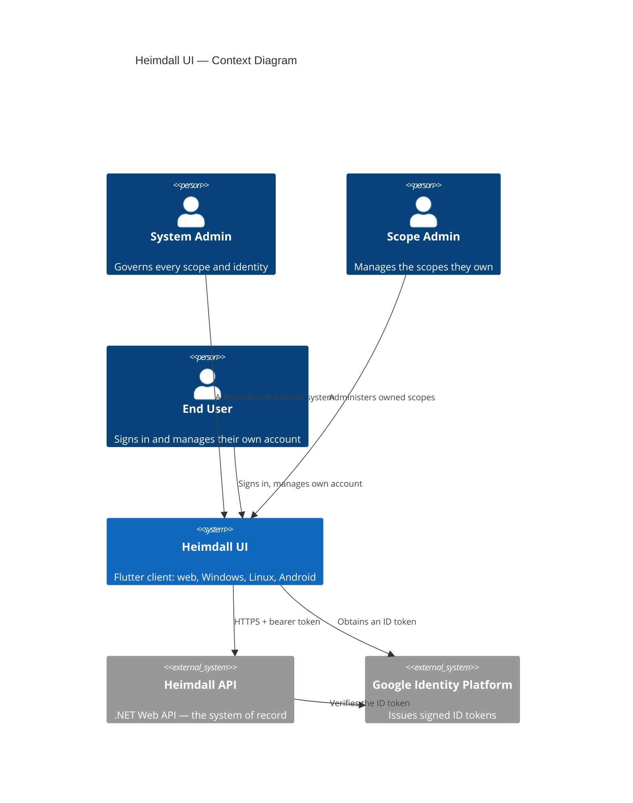

# Vision Document — Heimdall UI

## 1. Introduction

### 1.1 Purpose

This document establishes the vision for **Heimdall UI**, the Flutter front-end for the
[Heimdall API](https://github.com/artur-rios/heimdall-api) — a centralized identity-management API
with scope-based multi-tenancy.

### 1.2 Scope

Heimdall UI covers every use case the API exposes: the end-user flows (sign in, second factor,
Google sign-in, password recovery, email verification, own profile and security settings) and the
administrative console (scopes, persons, applications, scope permissions, and Google users), with
what each person sees determined by their role.

One codebase ships to four targets: a **web application** that runs in a browser, **Windows** and
**Linux** desktop applications, and an **Android** application. iOS and macOS are out of scope; the
code stays platform-neutral so adding them later is a configuration change rather than a rewrite.

### 1.3 Definitions and acronyms

| Term | Definition |
| --- | --- |
| **Scope** | A tenant boundary in the API that isolates the owners, users, and applications of one client system |
| **Person** | A registered identity: a User belongs to one scope, a Scope Admin owns one or more, a System Admin belongs to none |
| **Application** | A non-human identity within one scope, owned by exactly one person associated with that scope |
| **Scope Permission** | A named permission defined within a scope, optionally issued as a claim in that scope's tokens |
| **Google User** | An identity authenticated through Google rather than a password; always equivalent to the User role |
| **Public Id** | The GUID every entity is addressed by outside the database, and the only identifier this interface ever handles |
| **Session** | The client's record of who is signed in: the bearer token, its expiry, and the principal read from its claims |
| **Challenge** | The intermediate state between accepted credentials and a completed sign-in, while a second factor is outstanding |
| **Breakpoint** | The window-width class — compact, medium, or expanded — that determines the layout |
| **Envelope** | The API's uniform response body: `DataOutput<T>` for one record, `PaginatedOutput<T>` for a listing |

---

## 2. Problem statement

The Heimdall API is complete and well specified, but it has no interface. Every task it supports —
creating a scope, onboarding a person, adding a co-owner, turning on Google Sign-In, revoking an
application — is reachable only by composing HTTP requests by hand, with a token pasted between
them. That is workable for a developer holding the specification open, and unusable for anyone else.

The consequence is not merely inconvenience. Administrative work that has no interface tends to be
done rarely, done by the wrong person, or scripted once and forgotten, and identity administration
is precisely the kind of work where a mistake is expensive.

---

## 3. Product position statement

| Attribute | Description |
| --- | --- |
| **For** | Operators, administrators, and end users of systems that delegate identity to Heimdall |
| **Who** | Need to manage scopes, persons, applications, and permissions, or simply to sign in and manage their own account |
| **Heimdall UI** | Is a cross-platform Flutter client |
| **That** | Exposes every Heimdall API use case as a task-shaped screen, on the web, on Windows and Linux, and on Android |
| **Unlike** | Hand-composed HTTP calls, or a separate interface written per client system |
| **Our product** | Presents one interface over the whole API, adapts to the window it is given, and shows each person exactly the part of the system their role reaches |

---

## 4. Stakeholders

| Stakeholder | Role | Concern |
| --- | --- | --- |
| System Admin | Global administrator | Governing every scope, person, application, and permission from one place |
| Scope Admin | Owner of one or more scopes | Managing the users, applications, and permissions of the scopes they own, without seeing anyone else's |
| End User | Belongs to one scope | Signing in, recovering a password, verifying an address, and managing their own profile and second factor |
| Operator | Installs and configures the client | Building for each target, pointing the client at an API, and shipping it without embedding secrets |
| Heimdall API | The system of record | Being the only authority on data and authorization; the client must never assume otherwise |

---

## 5. High-level architecture

---

## 6. Core features

| ID | Feature | Description |
| --- | --- | --- |
| F-01 | Authentication | Sign in with credentials, answer a two-factor challenge, and sign out |
| F-02 | Account recovery | Request a password reset, set a new password, and verify an email address |
| F-03 | Google Sign-In | Sign in through Google where the scope allows it |
| F-04 | Self-service | View and edit your own profile, and manage your own two-factor authentication and recovery codes |
| F-05 | Scope management | Browse, create, view, update, and delete scopes; manage their owners; toggle Google Sign-In |
| F-06 | Person management | Browse, create, view, update, and delete the persons of a scope |
| F-07 | Application management | Browse, create, view, update, and delete the applications of a scope |
| F-08 | Permission management | Browse, create, view, update, and delete the permissions of a scope |
| F-09 | Google user management | Browse, view, and delete the Google users of a scope |
| F-10 | Adaptive presentation | One interface that reshapes itself for a phone, a tablet, and a desktop window, in light and dark |

---

## 7. Design principles

**The API is the authority.** The client holds no identity data of its own, caches nothing that
outlives a session, and enforces no rule the API does not already enforce. Role-driven navigation
exists so people are not offered work they cannot do — it is a usability affordance, never a
security boundary.

**Errors come from the API, in the API's words.** The envelope's `errors` array is shown as
returned rather than replaced with invented copy, so what a user reads matches what an operator
finds in the API's logs.

**One layout, three shapes.** Every screen is designed at the compact breakpoint first and given
more room as the window allows, rather than a desktop layout squeezed onto a phone.

**Destructive actions are deliberate.** Deletion always names the record; permanent deletion
additionally requires the record's name to be typed.

---

## 8. Constraints

- Built with **Flutter**, targeting web, Windows, Linux, and Android. The full stack is defined in
  the [Technology Stack Document](Technology%20Stack%20Document.md).
- The Dart API client is **generated** from the API's OpenAPI specification and never hand-edited.
- The API base URL is supplied as configuration at build time; it is never a compiled-in literal
  outside the local default.
- No secret is stored in the repository or in a built artifact. The client holds only a bearer token
  the user's own sign-in produced.
- Tokens are stored through the platform's secure storage, and a challenge token is never stored at
  all.
- Every identifier the client handles is a `PublicId` GUID.
- Every screen works at all three breakpoints and in both light and dark themes.
- No test reaches the network.

---

## 9. Success criteria

- A System Admin can perform every administrative task the API exposes without composing a single
  HTTP request.
- A Scope Admin sees their own scopes and nothing else, and can manage the users, applications, and
  permissions within them.
- An end user can sign in, answer a second factor, recover a password, verify an address, and manage
  their own profile and recovery codes.
- The same source builds and runs on the web, on Windows, on Linux, and on Android, with no
  behavioral difference beyond what the platforms themselves impose.
- Every screen is usable at all three breakpoints and legible in both themes.
- Every use case in the [Use Case Specification Document](Use%20Case%20Specification%20Document.md)
  ships with tests covering its main flow and each of its alternative flows.
